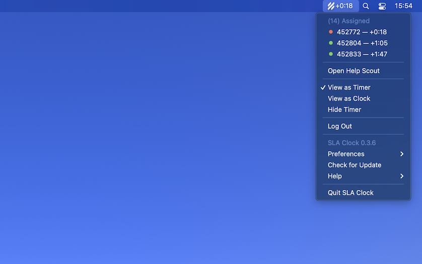

<div align="center">
  
  <h1>SLA Clock</h1>
  <p>
    <b>Remaining SLA time in your menu bar</b>
  </p>
</div>

SLA Clock is an unofficial menu bar extra for Help Scout with many useful features. To start watching your remaining SLA time, just drop the URL of a Help Scout mailbox folder onto the menu bar extra.

<p align="center">
  <a href="https://github.com/simonroth/sla-clock/releases/latest">
    
  </a>
</p>

## Install
*macOS 10.10+ is supported (64-bit only).*

[**Download**](https://github.com/simonroth/sla-clock/releases/latest) the `.dmg` file.

## Dev
Built with [Electron](https://electronjs.org).

### Run
```
$ npm install && npm start
```

### Build
See the [`electron-builder` docs](https://www.electron.build/multi-platform-build).

## Thanks
* [Caprine](https://github.com/sindresorhus/caprine) - Elegant Facebook Messenger desktop app -  for the conceptual inspiration

## Disclaimer
SLA Clock is a third-party menu bar extra and is not affiliated with Help Scout.
